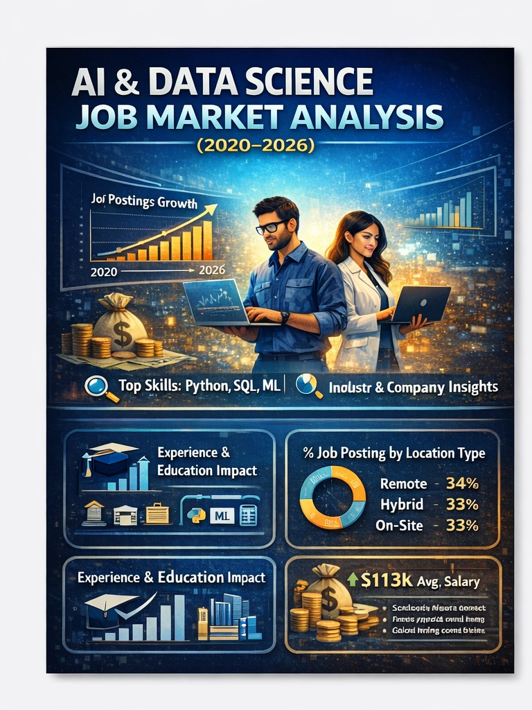
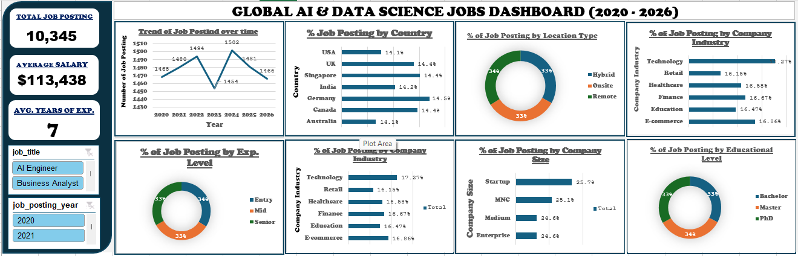

# GLOBAL AI DATA SCIENCE JOBS ANALYSIS 2020-2026

## INTRODUCTION

This project is one of the projects I completed as a student data analyst at FadaQa scholarship program. 
The evolution of Artificial Intelligence (AI) and Data Science continues to reshape industries worldwide. Organizations increasingly leverage data-driven technologies, driving growing demand for professionals with analytical and technical expertise. This study analyzes global AI and Data Science job trends from 2020 to 2026, highlighting patterns in job distribution, salary levels, experience requirements, company industries, and work structures.

## ABOUT THE DATASET

The dataset provides insights into global AI and Data Science job postings across multiple dimensions, including: total number of job postings, average salary offered, required years of experience, job trends over time (2020–2026), distribution by country, work location type (Remote, Hybrid, and Onsite), experience level distribution, company size and industry, and educational qualification requirements.

## PROBLEM STATEMENT

In a rapidly evolving tech market, stakeholders (job seekers, recruiters, and educational institutions) need to identify: how job demand is fluctuating over time, which industries and company sizes are driving the most hiring, the standard educational and experience benchmarks required to remain competitive in the AI and Data Science fields, trends in AI and Data Science job markets over time, demand patterns across countries and industries, evaluate how job roles vary by company size, education, and work setup.

## VISUALIZATION

Microsoft Excel was used to create this interactive dashboard. It utilizes several visual elements to represent the data such as line Chart, donut Charts, horizontal bar Charts and slicers.

## INSIGHTS

1. **Market Stability**: Despite a sharp dip in 2023 (1,454 postings), the market rebounded to its peak in 2024 (1,502) and remains relatively stable through 2026.

2. **Balanced Work Modes**: There is a near-perfect split between Remote (34%), Hybrid (33%), and Onsite (33%) work, suggesting high flexibility in the field.

3. **Industry Leaders**: The Technology sector leads hiring at 17.27%, closely followed by E-commerce (16.86%) and Finance (16.67%).

4. **Company Size**: Startups and Multinational Corporations (MNCs) are the most active recruiters, combined accounting for over 50% of the postings.

5. **Educational Parity**: Demand is almost equally distributed across Bachelor (33%), Master (34%), and PhD (33%) holders, indicating opportunities at all levels of higher education.

6. **Experience Levels**: Demand is evenly spread across entry, mid, and senior roles, making the field accessible at all career stages.

## RECOMMENDATIONS

1. **For Job Seekers**:
- Focus on in-demand skills (Machine Learning, Python, Data Analysis)
- Build real-world projects and portfolios
- Take advantage of remote job opportunities globally
- Explore opportunities across multiple industries, not just tech

2. **For Employers**
- Adopt flexible work models (remote/hybrid)
- Invest in training and upskilling entry-level talent
- Expand hiring across global talent pools
- Encourage cross-industry AI integration

## CONCLUSION

The global AI and Data Science job market is stable, flexible, and widely distributed. While minor fluctuations occur over time, overall demand remains strong across countries, industries, and experience levels.
The key defining features of the market include:
- Global accessibility of opportunities
- Balanced workforce demand
- Industry-wide AI adoption
- Shift toward skill-based hiring

Overall, AI and Data Science remain highly promising and future-proof career paths in the modern digital economy. The AI job market is globally competitive, resilient, flexible, and industry-wide, with skills—not just degrees—being the key driver of opportunities.
